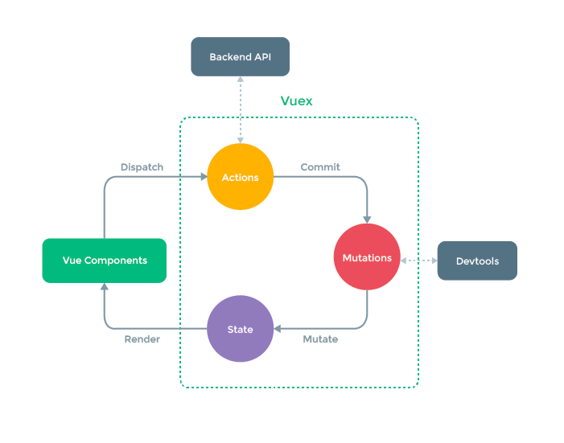

# Nuxt란?

Nuxt는 Vue.js로 빠르게 웹을 제작할 수 있게 도와주는 프레임워크입니다.  
웹 애플리케이션을 제작할 때 필요한 뷰엑스, 라우터, Axios와 같은 라이브러리들을 미리 구성하여 싱글 페이지 애플리케이션(Single Page Application), 서버 사이드 렌더링(Server Side Rendering), 정적 웹 사이트(Static Generated Website)를 쉽게 제작할 수 있습니다.

> ### TIP
>
> 서버 사이드 렌더링이란 웹 페이지의 내용을 서버에서 모두 작성해서 클라이언트(브라우저)로 보낸 뒤 화면에 그리는 방식을 의미합니다.

<br/>

# Nuxt의 장점

Nuxt로 개발했을 때의 장점은 다음과 같습니다.

- 검색 엔진 최적화
- 초기 프로젝트 설정 비용 감소와 생산성 향상
  - ESLint, Prettier
  - 라우터, 스토어 등의 라이브러리 설치 및 설정 파일 필요 X
  - 파일 기반의 라우팅 방식. 설정 파일 자동 생성
- 페이지 로딩 속도와 사용자 경험 향상
  - 브라우저가 하는 일을 서버에 나눠준다
  - 모르면 지나칠 수 있는 코드 스플리팅이 기본으로 설정

<br/>

# Nuxt 특징

Nuxt의 특징을 요약해보면 크게 아래와 같이 구분됩니다.

- 서버 사이드 렌더링
- 규격화된 폴더 구조(layout, store, middleware, plugins 등)
- pages 폴더 기반의 자동 라우팅 설정
- 코드 스플리팅
- 비동기 데이터 요청 속성
- ES6/ES6+ 변환
- 웹팩을 비롯한 기타 설정

<br/>

# Nuxt 시작하기

Nuxt 프로젝트를 구성하기 위해 다음 명령어를 실행합니다.

```java
npm init nuxt-app 프로젝트명

** 해당 명령어를 사용하여 파일을 생성시 규격화된 폴더 구조를 가진 프로젝트 생성
```

프로젝트가 생성되고 나면 명령어 실행 창을 참고하여 아래 명령어를 실행합니다.

```java
cd 프로젝트명

npm run dev
```

명령어 실행 창에 안내된 주소를 브라우저에 입력하고 결과를 확인합니다.

nuxt를 사용하는 이유

1. 가장 큰 이유는 router를 자동으로 생성 및 업데이트 해준다
   ```java
   해당 기능의 경우 기존 vue 페이지가 새롭게 만들어질 경우 직접 route를 등록해야하는 불편함을 개선한 기능이다.
   pages폴더 아래에 파일을 생성하면, 디렉토리 구조를 기반으로 자동으로 router를 관리해준다
   ```
2. Server Side Rendering(SSR)
   ssr와 대조되는 기능으로는 csr(client) 이다
   - 클라이언트단에서 화면을 그리는지, 서버에서 화면을 그려서 클라이언트로 전송하는지에 따라 다르다
   - 해당 기능으로 보는 이득은 ** 검색엔진의 최적화 **
     - 검색엔진에서 사이트 데이터를 수집할 때 ssr의 경우 미리 화면에 그려져 있기 때문에 좀 더 정확한 데이터 수집이 가능하다
   - 페이지 로딩 속도 향상
     - 클라이언트단에서 모든 화면을 구성할 경우, 클라이언트가 느끼기에 속도가 느려보일 수 있는 치명적인 단점이 존재
     - 서버단에서 일부분 그려준 다음 클라이언트로 던져줘서 구성할 경우, 좀 더 빠른 화면 구성이 가능하다

### v-model

value 속성과, @input event 로 이루어진 양방향 통신 속성

## vuex

> vue.js의 상태 관리 라이브러리이자 패턴을 의미



> 데이터의 흐름은 `Actions` -> `Mutations` -> `State` 순서임을 알 수 있습니다.

<br/>

## 뷰엑스 기술 요소

뷰엑스의 주요 기술 요소는 다음과 같습니다.

- state
- getters
- mutations
- actions

```java
'vuex'는 기본적으로 'js'로 구성되어있다
js의 특징은 '브라우저'가 '새로고침' 되었을 경우 '초기화' 되는 '특성'을 가지고 있기 때문에, 사용의 유의하여야 한다
```
